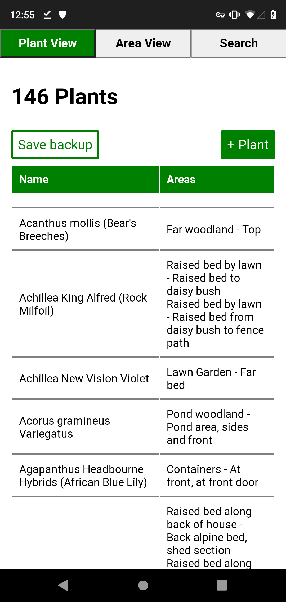
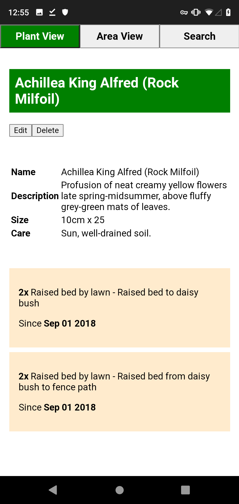
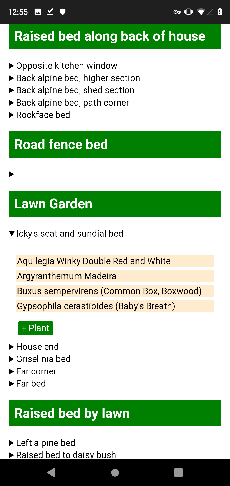
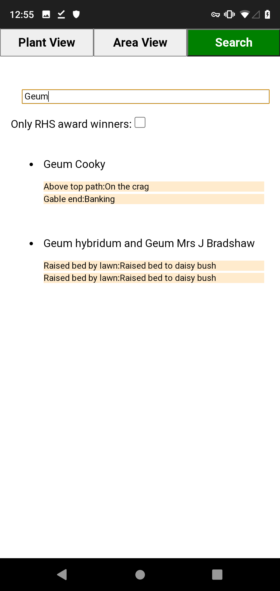

# GrannyPlant

A mobile application to help granny organise her plants :)

The previous iteration is [here](https://github.com/macarc/grannyplant). That version was mostly designed for desktop use, while online. This is more designed for mobile use while offline.

## Structure

I decided to try using JavaScripts prototype-based inheritance. All the views are parented by the same View object which holds some global state (e.g. all the urls). It worked alright.

## Screenshots

